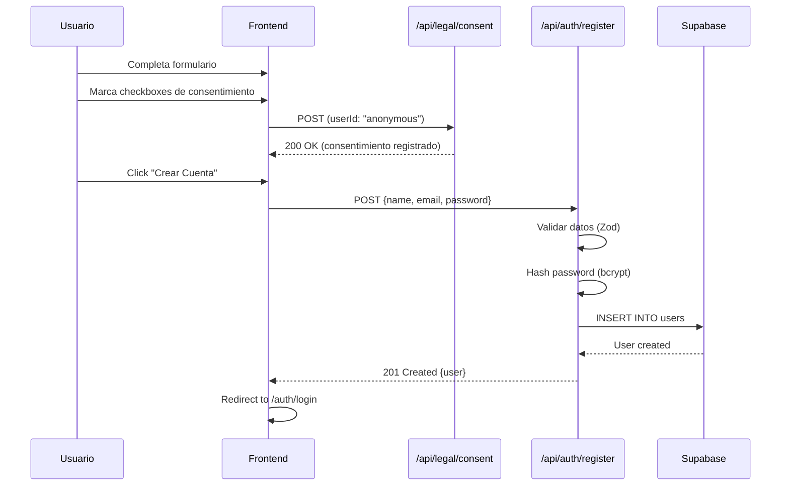
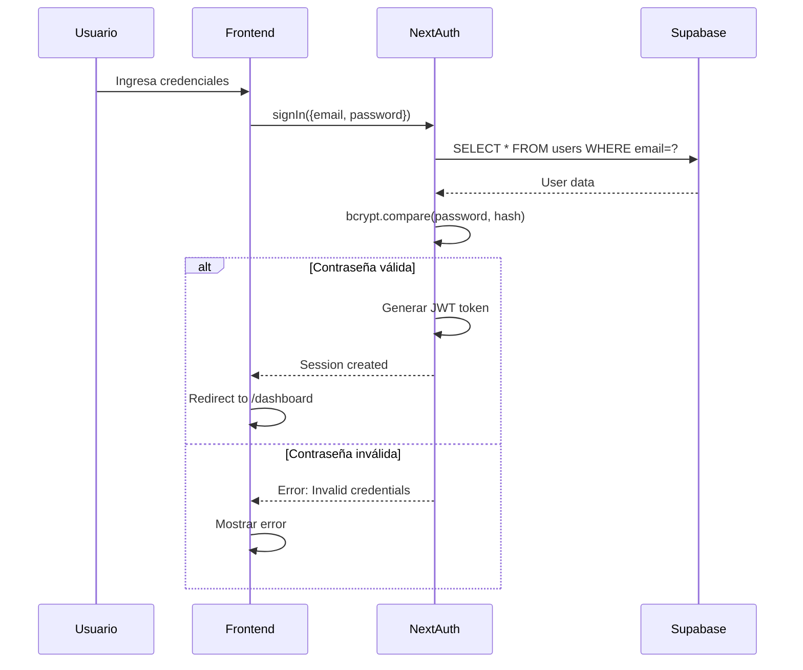
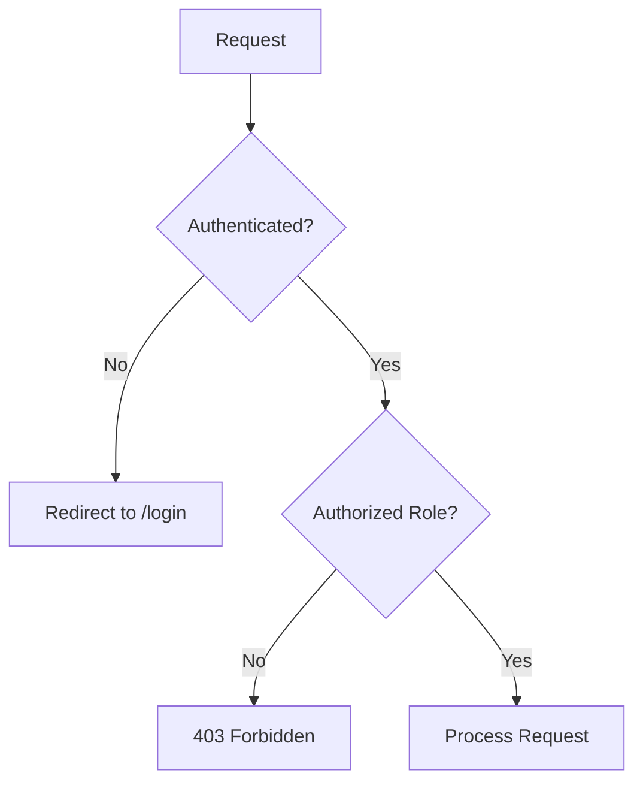

# Arquitectura del Sistema - SinapCode

**Versión:** 1.0.0  
**Fecha:** 12 de enero de 2026

## 1. Visión General

SinapCode es una aplicación web moderna construida con Next.js 14, utilizando arquitectura de microservicios y serverless.

```
┌─────────────────────────────────────────────────────────────┐
│                        USUARIOS                              │
│         (Estudiantes, Profesores, Administradores)          │
└────────────────────┬────────────────────────────────────────┘
                     │
                     ▼
┌─────────────────────────────────────────────────────────────┐
│                    VERCEL EDGE NETWORK                       │
│              (CDN, DDoS Protection, SSL/TLS)                 │
└────────────────────┬────────────────────────────────────────┘
                     │
                     ▼
┌─────────────────────────────────────────────────────────────┐
│                   NEXT.JS 14 APPLICATION                     │
│  ┌──────────────┐  ┌──────────────┐  ┌──────────────┐      │
│  │   Frontend   │  │  API Routes  │  │  Middleware  │      │
│  │  (React 18)  │  │  (Serverless)│  │  (Auth, etc) │      │
│  └──────────────┘  └──────────────┘  └──────────────┘      │
└────────────────────┬────────────────────────────────────────┘
                     │
        ┌────────────┼────────────┐
        │            │            │
        ▼            ▼            ▼
┌──────────────┐ ┌──────────────┐ ┌──────────────┐
│   NextAuth   │ │    Prisma    │ │   External   │
│   (Auth)     │ │    (ORM)     │ │   Services   │
└──────┬───────┘ └──────┬───────┘ └──────────────┘
       │                │
       │                ▼
       │         ┌──────────────┐
       │         │   Supabase   │
       │         │  PostgreSQL  │
       │         └──────────────┘
       │
       ▼
┌──────────────┐
│  OAuth       │
│  Providers   │
│ (Google, GH) │
└──────────────┘
```

## 2. Capas de la Aplicación

### 2.1 Capa de Presentación (Frontend)

**Tecnologías:**
- React 18 (Server Components + Client Components)
- Tailwind CSS (estilos)
- Framer Motion (animaciones)
- Lucide React (iconos)

**Estructura:**
```
src/app/
├── (auth)/           # Grupo de rutas de autenticación
│   ├── login/
│   └── register/
├── dashboard/        # Dashboard de usuario
├── profile/          # Perfil de usuario
└── api/             # API Routes
```

### 2.2 Capa de Lógica de Negocio (API Routes)

**Endpoints Principales:**

```
/api/auth/
├── register         POST   - Registro de usuarios
├── [...nextauth]    *      - NextAuth endpoints
└── session          GET    - Obtener sesión actual

/api/legal/
└── consent          POST   - Registrar consentimiento

/api/user/
├── profile          GET    - Obtener perfil
├── profile          PUT    - Actualizar perfil
├── data-export      GET    - Exportar datos (GDPR)
└── delete           DELETE - Eliminar cuenta (GDPR)
```

### 2.3 Capa de Datos

**ORM:** Prisma  
**Base de Datos:** PostgreSQL (Supabase)

**Modelos Principales:**
- `User` - Usuarios del sistema
- `Account` - Cuentas OAuth
- `Session` - Sesiones de NextAuth
- `LegalConsent` - Consentimientos legales

## 3. Flujos Principales

### 3.1 Flujo de Registro



### 3.2 Flujo de Login



### 3.3 Flujo de Autorización



## 4. Seguridad

### 4.1 Autenticación

- **Método:** Credentials + OAuth (Google, GitHub)
- **Sesiones:** JWT tokens (httpOnly cookies)
- **Expiración:** 24 horas
- **Refresh:** Automático

### 4.2 Autorización

**Roles:**
- `STUDENT` - Acceso a cursos y ejercicios
- `TEACHER` - Crear contenido, ver progreso de estudiantes
- `ADMIN` - Acceso completo al sistema

**Middleware de Autorización:**
```typescript
export function withAuth(handler, allowedRoles: Role[]) {
  return async (req, res) => {
    const session = await getServerSession(req, res, authOptions);
    
    if (!session) {
      return res.status(401).json({ error: 'Unauthorized' });
    }
    
    if (!allowedRoles.includes(session.user.role)) {
      return res.status(403).json({ error: 'Forbidden' });
    }
    
    return handler(req, res);
  };
}
```

### 4.3 Protección de Datos

| Dato | En Tránsito | En Reposo |
|------|-------------|-----------|
| Contraseñas | TLS 1.3 | Bcrypt (10 rounds) |
| Tokens | TLS 1.3 | JWT firmado |
| Datos personales | TLS 1.3 | Cifrado AES-256 (Supabase) |

## 5. Escalabilidad

### 5.1 Horizontal Scaling

- **Frontend:** Vercel Edge Network (automático)
- **API Routes:** Serverless functions (auto-scaling)
- **Base de Datos:** Connection pooling (PgBouncer)

### 5.2 Caching

```
┌─────────────┐
│   Browser   │ ← Cache de assets estáticos (1 año)
└─────────────┘
       ↓
┌─────────────┐
│ Vercel Edge │ ← Cache de páginas estáticas (ISR)
└─────────────┘
       ↓
┌─────────────┐
│  Next.js    │ ← Cache de datos (React Cache)
└─────────────┘
       ↓
┌─────────────┐
│  Supabase   │ ← Query cache (Prisma)
└─────────────┘
```

### 5.3 Performance

**Métricas Objetivo:**
- **TTFB:** < 200ms
- **FCP:** < 1.8s
- **LCP:** < 2.5s
- **CLS:** < 0.1
- **FID:** < 100ms

## 6. Monitoreo y Observabilidad

### 6.1 Logs

- **Aplicación:** Console logs (desarrollo), Vercel Logs (producción)
- **Base de Datos:** Supabase Logs
- **Errores:** Sentry (planificado)

### 6.2 Métricas

- **Uptime:** Vercel Analytics
- **Performance:** Web Vitals
- **Errores:** Error rate, stack traces

### 6.3 Alertas

| Evento | Umbral | Acción |
|--------|--------|--------|
| Error rate > 5% | 5 min | Email + Slack |
| Response time > 2s | 10 min | Email |
| Uptime < 99.9% | Inmediato | Email + SMS |

## 7. Despliegue

### 7.1 CI/CD Pipeline

```
┌──────────┐     ┌──────────┐     ┌──────────┐     ┌──────────┐
│   Push   │────▶│  GitHub  │────▶│  Vercel  │────▶│Production│
│  to main │     │  Actions │     │  Build   │     │  Deploy  │
└──────────┘     └──────────┘     └──────────┘     └──────────┘
                      │
                      ├─ Lint (ESLint)
                      ├─ Type Check (TypeScript)
                      ├─ Tests (Jest)
                      └─ Security Scan (npm audit)
```

### 7.2 Ambientes

| Ambiente | URL | Branch | Propósito |
|----------|-----|--------|-----------|
| **Desarrollo** | localhost:3000 | - | Desarrollo local |
| **Preview** | *.vercel.app | feature/* | Testing de features |
| **Producción** | sinap-code.vercel.app | main | Usuarios finales |

## 8. Dependencias Externas

| Servicio | Propósito | Criticidad | Fallback |
|----------|-----------|------------|----------|
| Supabase | Base de datos | CRÍTICO | Backup manual |
| Vercel | Hosting | CRÍTICO | Ninguno |
| Google OAuth | Autenticación | MEDIO | Credentials |
| GitHub OAuth | Autenticación | BAJO | Credentials |

## 9. Diagrama de Componentes

```
┌─────────────────────────────────────────────────────────┐
│                     SINAPCODE WEB APP                    │
├─────────────────────────────────────────────────────────┤
│                                                          │
│  ┌────────────────────────────────────────────────┐    │
│  │           PRESENTATION LAYER                    │    │
│  │  ┌──────────┐  ┌──────────┐  ┌──────────┐     │    │
│  │  │  Pages   │  │Components│  │  Hooks   │     │    │
│  │  └──────────┘  └──────────┘  └──────────┘     │    │
│  └────────────────────────────────────────────────┘    │
│                         │                               │
│  ┌────────────────────────────────────────────────┐    │
│  │           BUSINESS LOGIC LAYER                  │    │
│  │  ┌──────────┐  ┌──────────┐  ┌──────────┐     │    │
│  │  │API Routes│  │ Services │  │Validators│     │    │
│  │  └──────────┘  └──────────┘  └──────────┘     │    │
│  └────────────────────────────────────────────────┘    │
│                         │                               │
│  ┌────────────────────────────────────────────────┐    │
│  │            DATA ACCESS LAYER                    │    │
│  │  ┌──────────┐  ┌──────────┐  ┌──────────┐     │    │
│  │  │  Prisma  │  │  Models  │  │  Schemas │     │    │
│  │  └──────────┘  └──────────┘  └──────────┘     │    │
│  └────────────────────────────────────────────────┘    │
│                         │                               │
└─────────────────────────┼───────────────────────────────┘
                          │
                          ▼
                  ┌──────────────┐
                  │   SUPABASE   │
                  │  PostgreSQL  │
                  └──────────────┘
```

---

**Última Actualización:** 12 de enero de 2026  
**Versión:** 1.0.0  
**Mantenedor:** Equipo de Arquitectura SinapCode
